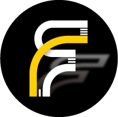
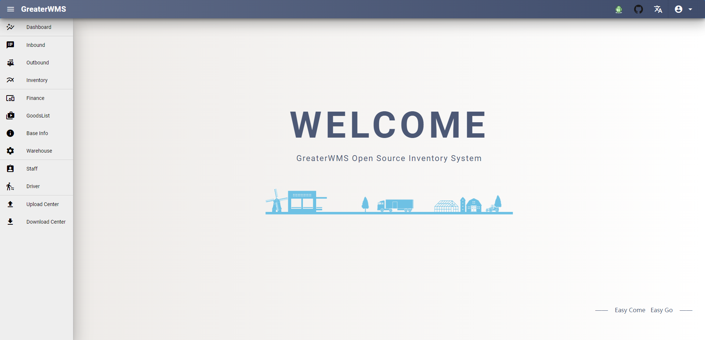
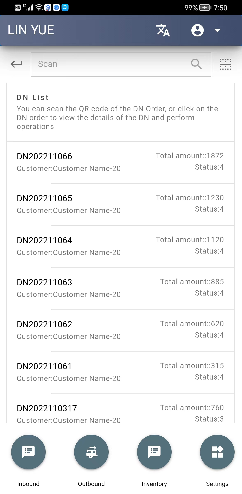
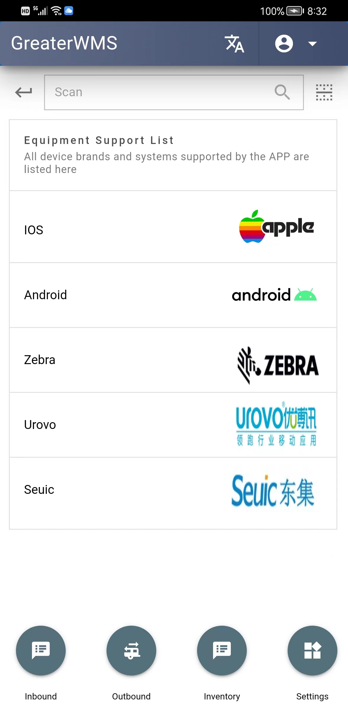

  
  <h1>GreaterWMS</h1>
  
Open Source Inventory Management System 

<!-- Badges -->

#### You can share your vacant warehouse space, use it for those in need, and generate income

## :rocket: Link US
<h4>
    <a href="https://www.56yhz.com/">Home Page</a>
</h4>
<h4>
    <a href="https://production.56yhz.com/">Demo</a>
</h4>
<h4>
  <a href="https://www.youtube.com/channel/UCPW1wciGMIEh7CYOdLnsloA">Video Tutorials</a>
</h4>
<h4>
  <a href="https://github.com/GreaterWMS/GreaterwMS/issues/new?template=bug_report.md&title=[BUG]">Report Bug</a>
</h4>
<h4>   
  <a href="https://github.com/GreaterWMS/GreaterWMS/issues/new?template=feature_request.md&title=[FR]">Request Feature</a>
</h4>
<h4>
  <a href="https://www.56yhz.com/zh/greaterwms.html">中文文档</a>
</h4>

[//]: # (About the Project)
## :star2: About the Project

This Inventory management system is the currently Ford Asia Pacific after-sales logistics warehousing supply chain process.
After I leave Ford, I start this project in order to help some who need it. 
OneAPP Type. Support scanner PDA, mobile APP, desktop exe, website as well.

[//]: # (Function)
## :dart: Function

* [x] Multiple Warehouses
* [x] Supplier Management
* [x] Customer Management
* [x] Scanner PDA
* [x] Cycle Count
* [x] Order Management
* [x] Stock Control
* [x] Safety Stock Show
* [x] API Documents
* [x] IOS APP Support
* [x] Android APP Support
* [x] Electron APP Support
* [x] Auto Update
* [x] i18n Support
* [x] API Documents

[//]: # (Install)
## :compass: Install
Python install
- [python 3.8.10](https://www.python.org/downloads/release/python-3810/)

Nodejs install
- [nodejs 14.19.3](https://nodejs.org/download/release/v14.19.3/)

Twisted install
- Please google how to install Twisted , if you have some problem on install it . 

Clone Project
~~~shell
git clone https://github.com/GreaterWMS/GreaterWMS.git
~~~

### docker(Optional)
~~~shell
cd GreaterWMS/
docker-compose up -d
# Change Baseurl
# baseurl GreaterWMS/templates/public/statics/baseurl.txt
docker-compose restart
~~~

<h4>
  <a href="https://www.56yhz.com/win_10.html">Windows X64</a>
</h4>
<h4>
  <a href="https://www.56yhz.com/centos_7.html">Centos 7</a>
</h4>
<h4>
  <a href="https://www.56yhz.com/ubuntu_20.html">Ubuntu 20</a>
</h4>

[//]: # (development)
## :hammer_and_wrench: How To Run Development Server:

- Run Backend:
~~~shell
cd GreaterWMS
daphne -p 8008 greaterwms.asgi:application
or
daphne -b 0.0.0.0 -p 8008 greaterwms.asgi:application # lan
~~~

- Run Frontend:
~~~shell
cd templates
quasar d
~~~

- Change Request Baseurl
~~~shell
templates/public/statics/baseurl.txt
~~~

- API Documents

~~~shell
baseurl + '/docs/'
~~~

### Companion Mobile APP

- App Source Code

~~~shell
npm install cordova -g

cd app
yarn install
## Development
quasar d -m cordova -T [android, ios]
## Deploy
quasar build -m [android, ios]
~~~

- You can directly use app if you don't want to build it 

GreaterWMS is supported by a companion mobile app which allows users access to run the business well.
It can scan the goods by your camera or your PDA scanner.

[IOS](https://apps.apple.com/gb/app/intelligent-warehousing-gwms/id6444078526)

[Android](https://production.56yhz.com/media/GWMS.apks)

## Download Android installer tools

!!! info "Android"
    
    App store search

    Split APKs Installer 

## Directly download installer tools

[Sai](https://po.56yhz.com/media/sai.apk)

- Open Sai APP, choose GWMS.apks then install

[//]: # (publish)
## :trumpet: How To Publish Your APP:

- Web Build:

~~~shell
cd templates
quasar build
~~~

[//]: # (deploy)
## :computer: How To Deploy Server:

<h4>
  <a href="https://www.56yhz.com/supervisor_process_guarded.html">Supervisor Process Guarded</a>
</h4>
<h4>
  <a href="https://www.56yhz.com/nginx_config.html">Nginx Config</a>
</h4>

If the server has SSL enabled, please use HTTPS and WSS, if SSL is not enabled, use HTTP and WS

The front-end code needs to be rebuilt after modification.

## Show

    

    
    
    

