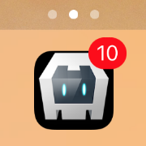
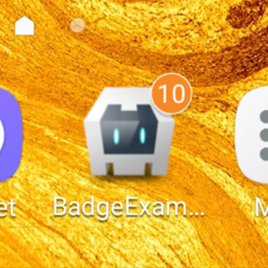
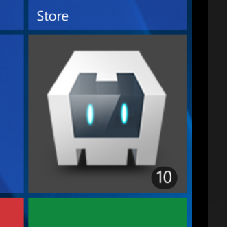
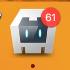
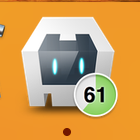
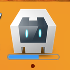
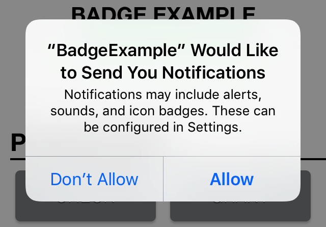

<p align="left"><b><a href="https://github.com/katzer/cordova-plugin-badge/tree/example">SAMPLE APP</a> :point_right:</b></p>

# Cordova Badge Plugin <br> [](https://badge.fury.io/js/cordova-plugin-badge) [](https://codeclimate.com/github/katzer/cordova-plugin-badge) [](https://www.paypal.com/cgi-bin/webscr?cmd=_s-xclick&hosted_button_id=L3HKQCD9UA35A "Donate once-off to this project using Paypal")

[Cordova][cordova] plugin to access and modify the badge number of the app icon on various mobile platforms including iOS, Android and Windows.

</img>

### How they appear to the user

Users see notifications in the following ways:

- Badging the app’s icon
- Progress indicator (OSX based on https://github.com/hokein/DockProgressBar)


### Supported Platforms

- __Android / Amazon FireOS__ (via [ShortcutBadger][shortcut_badger])
- __Browser__ (via [favico.js][favico_js])
- __iOS 10+__
- __OSX__
- __Windows__ (Phone and Desktop)


## Installation

The plugin can be installed via [Cordova-CLI][CLI] and is publicly available on [NPM][npm].

Execute from the projects root folder:

    $ cordova plugin add cordova-plugin-badge

Or install a specific version:

    $ cordova plugin add cordova-plugin-badge@VERSION

Or install the latest head version:

    $ cordova plugin add https://github.com/katzer/cordova-plugin-badge.git

Or install from local source:

    $ cordova plugin add <path> --nofetch --nosave


## Usage

The plugin creates the object `cordova.plugins.notification.badge` and is accessible after *deviceready* has been fired.

```js
document.addEventListener('deviceready', function () {
    // cordova.plugins.notification.badge is now available
}, false);
```

### Set the badge number

Badge numbers cannot be negative. The maximum might be restricted by the OS.
A callback is optional and will be invoked with the current badge number.

```js
cordova.plugins.notification.badge.set(10);
```

<p align="center">
    
    &nbsp;&nbsp;&nbsp;&nbsp;
    
    &nbsp;&nbsp;&nbsp;&nbsp;
    
</p>

There's built-in support to increase the badge number:

```js
cordova.plugins.notification.badge.increase(1, function (badge) {
    // badge is now 11 (10 + 1)
});
```

To decrease the badge number:

```js
cordova.plugins.notification.badge.decrease(2, function (badge) {
    // badge is now 9 (11 - 2)
});
```

And to clear out the badge number:

```js
cordova.plugins.notification.badge.clear();
```

### Get the badge number

The default value is 0. The badge number wont get lost after reboot or app restart.

```js
cordova.plugins.notification.badge.get(function (badge) {
    ...
});
```

__Note:__ Modifying the badge number outside of the plugin does result into wrong behaivor!

### Configurations

To clear the badge number automatically if the user taps the app icon:

```js
cordova.plugins.notification.badge.configure({ autoClear: true });
```

OSX supports additional indicators. Other than to `badge` these are `circular` and `download`.

```js
cordova.plugins.notification.badge.configure({ indicator: 'circular' });
```

<p align="center">
    
    &nbsp;&nbsp;&nbsp;&nbsp;
    
    &nbsp;&nbsp;&nbsp;&nbsp;
    
</p>


## Permissions

The plugin might ask for granting permissions to modify the badge number.
That's done automatically but it's also possible to request them manually:

```javascript
cordova.plugins.notification.badge.requestPermission(function (granted) {
    ...
});
```

<p align="center">
    
</p>

To check if they have been granted already:

```javascript
cordova.plugins.notification.badge.hasPermission(function (granted) {
    ...
});
```


## Quirks

On Android not all launchers support badges. In order to set badges the plugin uses [ShortcutBadger][shortcut_badger]. Check out their website to see which launchers are supported.

If you're using PhoneGap Build please make sure you specify gradle as your Android build tool in config.xml:

```xml
<preference name="android-build-tool" value="gradle" />
```

To specify a custom version of _ShortcutBadger_ follow this [guide][gradle-guide]. The name of the property is `appShortcutBadgerVersion`.

```gradle
# In <your-project>/platforms/android/gradle.properties
appShortcutBadgerVersion=1.1.22
```


## Contributing

1. Fork it
2. Create your feature branch (`git checkout -b my-new-feature`)
3. Commit your changes (`git commit -am 'Add some feature'`)
4. Push to the branch (`git push origin my-new-feature`)
5. Create new Pull Request


## License

This software is released under the [Apache 2.0 License][apache2_license].

Made with :yum: from Leipzig

© 2013 [appPlant GmbH][appplant]


[cordova]: https://cordova.apache.org
[shortcut_badger]: https://github.com/leolin310148/ShortcutBadger
[favico_js]: http://lab.ejci.net/favico.js/
[CLI]: http://cordova.apache.org/docs/en/edge/guide_cli_index.md.html#The%20Command-line%20Interface
[npm]: https://www.npmjs.com/package/cordova-plugin-badge
[gradle-guide]: https://cordova.apache.org/docs/en/latest/guide/platforms/android/#configuring-gradle
[apache2_license]: http://opensource.org/licenses/Apache-2.0
[appplant]: http://appplant.de
