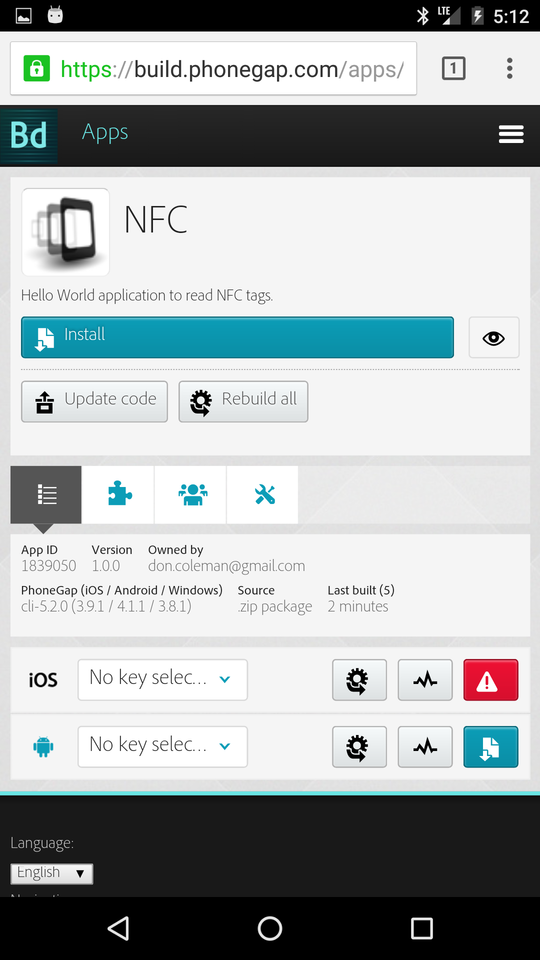
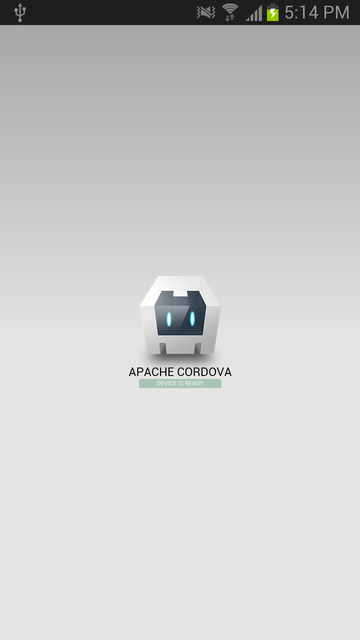
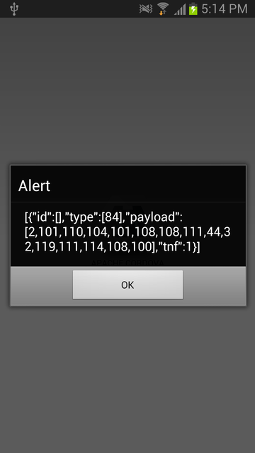
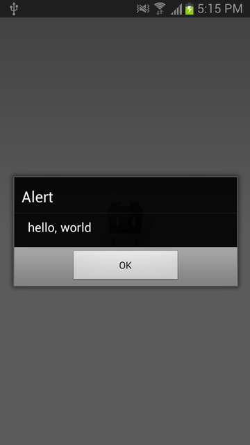

## Quickstart for PhoneGap NFC with PhoneGap Build

These instructions use [PhoneGap](http://phonegap.com/) to generate a default PhoneGap app, modify it to read NFC tags and build using [PhoneGap Build](http://build.phonegap.com).

### PhoneGap Command Line Interface (CLI)

The PhoneGap Command Line Interface [phonegap-cli](https://npmjs.org/package/phonegap) can be used to create, build and run multi-platform PhoneGap projects. PhoneGap CLI requires [node.js](http://nodejs.org).

    $ npm install phonegap -g

### Generate a project

    $ cd ~
    $ phonegap create nfc com.example.nfc NFC

### Install the Plugin

Change to the project directory

    $ cd nfc

Edit `config.xml` and add a line to install the plugin

    <gap:plugin name="phonegap-nfc" source="npm" />

### Edit `index.js`

Edit `index.js` and modify onDeviceReady with the following code

    onDeviceReady: function() {
        app.receivedEvent('deviceready');

        // Read NDEF formatted NFC Tags
        nfc.addNdefListener (
            function (nfcEvent) {
                var tag = nfcEvent.tag,
                    ndefMessage = tag.ndefMessage;

                // dump the raw json of the message
                // note: real code will need to decode
                // the payload from each record
                alert(JSON.stringify(ndefMessage));

                // assuming the first record in the message has
                // a payload that can be converted to a string.
                alert(nfc.bytesToString(ndefMessage[0].payload).substring(3));
            },
            function () { // success callback
                alert("Waiting for NDEF tag");
            },
            function (error) { // error callback
                alert("Error adding NDEF listener " + JSON.stringify(error));
            }
        );
    },

### Build the code using PhoneGap Build's servers

    $ phonegap remote build android

### Install the app from the PhoneGap Build website

Log into http://build.phonegap.com with your phone.

Download and install the app.

Run the app.

### Scan a NDEF tag

Scan an NDEF tag with your phone. If you need to put data on a tag, try writing a plain text message to a tag with [NXP Tag Writer](https://play.google.com/store/apps/details?id=com.nxp.nfc.tagwriter).

